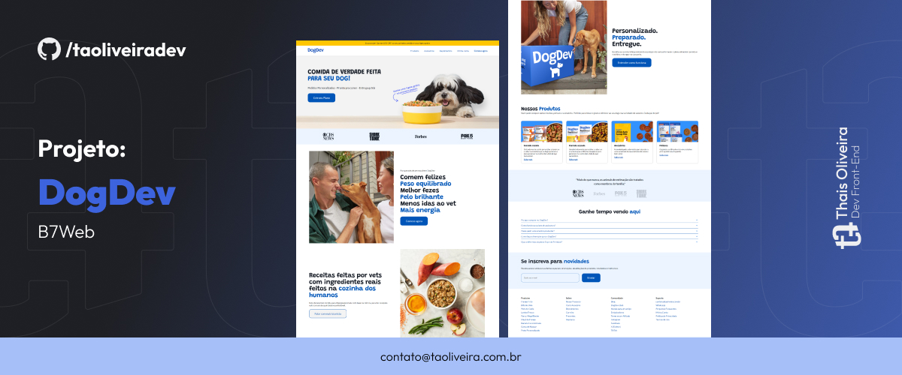

<h2> DogDev 🚀 </h2>

  

  

Este é o código-fonte do site DogDev, desenvolvido durante o curso "10 Projetos em HTML, CSS e Javascript" da B7Web. 

## Tecnologias

- HTML
- CSS
- SwiperJS

## Aprendizados

- Desenvolvimento web com HTML, CSS e Javascript;
- Criação de layouts responsivos utilizando a abordagem Mobile First;
- Organização e gerenciamento de código CSS com a técnica CSS Split.
- Utilização do javascript para desenvolver a seção de documentos com animação e o accordion da seção de FAQ

## Screenshots

## Acesse o projeto:

<a href="https://taoliveira.com.br/dogdev-b7web"> Ver Projeto</a>

Fique à vontade para explorar o código e me contatar caso tenha alguma dúvida ou sugestão! 😊

